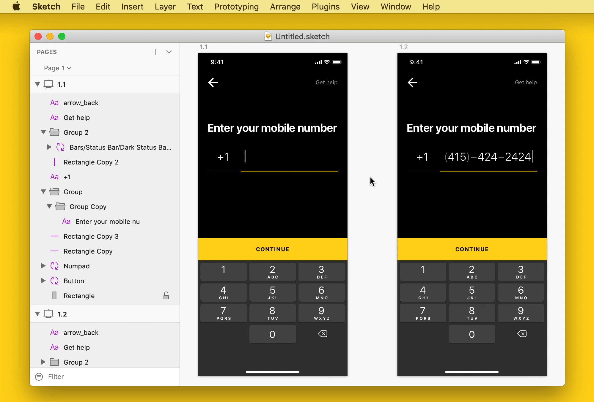

# Clean Document

> A Sketch plugin to automagically organise and clean up your Sketch document

## Commands

### Clean Layers

- Deletes hidden layers
- Unnests nested groups
- Rounds shapes to the nearest pixels
- Smart rename layers
- Operates on layers in the selection, or on layers on the current page if the selection is empty
- Skips processing of certain layers that match a whitelist regular expression

### Clean Symbols

- Deletes unused symbol masters
- Organises the Symbol page

### Clean Styles

- Deletes unused text styles and layer styles

### Clean Pages

- Deletes empty pages
- Sorts the pages in alphabetical order

### Clean Document

- Executes the above four commands on all layers, all symbols, all text styles and layer styles, and all pages in the current document

## Installation

1. [Download and unzip the latest release](https://github.com/yuanqing/sketch-clean-document/releases)
2. Double-click `Clean Document.sketchplugin` to install

## License

[MIT](LICENSE.md)
